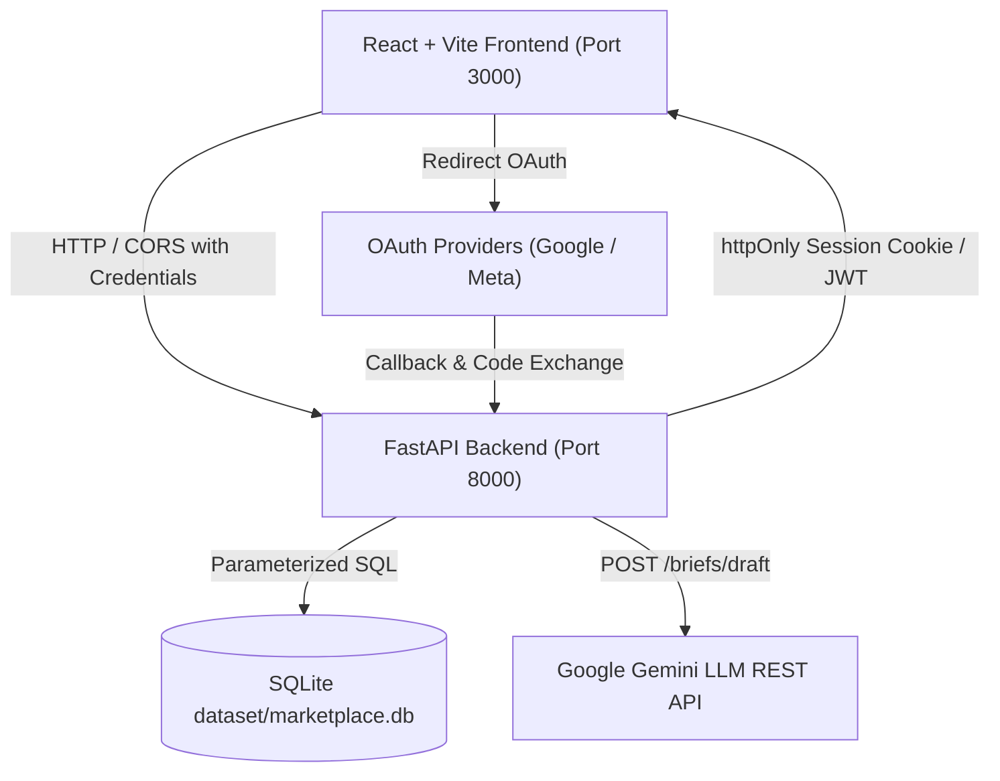

# GenCraft - AI Content Creator Marketplace 🚀

An end-to-end AI-native marketplace connecting generative AI creators (AI filmmakers, animators, prompt engineers, 3D generative artists) with brands and creative agencies. Built for byteXL HacXLerate 2026, Challenge 2 by Kampus.VC.

---

## ⚡ Feature Implementation Highlights

### 1. **Creator Onboarding & Profile Persistence (STEP 2)**
- **Interactive Onboarding Portal**: `/creator/onboarding` collects display name, professional headline, specialization (AI Filmmaker, Animator, Generative Artist, AI Advertiser, Motion Designer, Prompt Engineer), core skills, AI tools stack, experience level, rate range (INR), availability, location, languages, portfolio links, and commercial buyout preferences.
- **Backend Persistence**: Endpoint `PUT /creators/me` persists all onboarding fields to SQLite database with graceful demo fallback support.

### 2. **Creator Starter Studio (STEP 3)**
- **Personalized Project Suggestions**: 6 rule-based starter projects (Product Advertisement, Cinematic AI Microfilm, Animated Explainer, Social-Media Campaign, Generative Art Collection, Product Visualization) explaining why each fits creator skills/tools.
- **Production Guidance**: Includes aspect ratios, target duration, deliverables list, prompt-to-video workflow pipelines, and 5-step milestone checklists.
- **Progress Tracking & 1-Click Publishing**: Creators can save project ideas, track status (`not_started` ➔ `in_progress` ➔ `completed`), and launch 1-click portfolio publishing drawers.

### 3. **AI Portfolio Profiles & Full CRUD Management (STEP 4)**
- **Rich Portfolio Cards & Viewer**: Showcases title, media format, aspect ratios (16:9, 9:16, 1:1, 4:5), duration, documented production workflows (e.g. `Midjourney v6 -> Runway Gen-3 -> DaVinci Resolve`), prompt notes, and commercial status (`cleared`, `pending`, `personal_only`).
- **Creator Portfolio Management**: Endpoints (`POST /creators/me/portfolio`, `PUT /creators/me/portfolio/{id}`, `DELETE /creators/me/portfolio/{id}`) allow creators to add, edit, and delete portfolio items. Handles empty portfolios and missing thumbnails gracefully.

### 4. **Brand Brief Builder & AI Assistant (STEP 5)**
- **Structured Campaign Engine**: Collects campaign goals, content format, visual style, aspect ratios, duration, budget bounds (INR), deadline, required tools, usage region, and commercial buyout terms.
- **Gemini LLM Brief Builder**: `POST /briefs/draft` converts unstructured natural language campaign prompts into structured editable brief fields using Google Gemini REST API with deterministic rule-based fallback.

### 5. **Creator Search, Combined Filtering & Explainable Matching (STEP 6)**
- **Multi-Select Filter Engine**: Search by skills, specialization, tools/models, content format, experience level, availability, rate compatibility, and verified status.
- **Explainable Match Scoring**: 6-Factor weighted algorithm (0–100%) breaking down tool match (30%), skill match (30%), content format (15%), budget alignment (15%), availability (5%), and verification signals (5%).
- **Demonstrable No-Match Test Case**: Built-in `🧪 No-Match Test Case` button in `/creators` directory to test empty-result states, loading indicators, and 1-click filter resets.

### 6. **Verification & Trust System (STEP 7)**
- **Honest Verification Badges**: Distinct status labels for Self-reported tool usage, Workflow documented, Past work linked, Evidence reviewed, and Commercial rights confirmed.

### 7. **Engagement Workflow & Delivery Management (STEP 8)**
- **End-to-End Application Pipeline**: Creators apply to briefs with pitch proposals, rate quotes, and delivery timelines (`POST /briefs/{id}/apply`).
- **Brand Applicant Review**: Brands shortlist, accept, or reject creators (`PUT /briefs/applications/{id}`).
- **Delivery Submission & Revision Requests**: Creators submit final delivery URLs and notes (`POST /briefs/applications/{id}/deliver`). Brands can request revisions or approve work.
- **Simulated Escrow Payment**: Status badges track `escrow_pending` ➔ `escrow_held` ➔ `payment_released`.

---

## 🔐 Demo Credentials (For Hackathon Evaluators)

Evaluators can sign in immediately using the 1-click demo access buttons on `/login` or via the top Navbar dropdown:

| Role | Email | Password | Linked Entity |
| :--- | :--- | :--- | :--- |
| **Demo Creator** | `demo.creator@gencraft.demo` | `DemoCreator123!` | Linked to `cr_001` (Ananya Rao - Senior AI Filmmaker) |
| **Demo Brand** | `demo.brand@gencraft.demo` | `DemoBrand123!` | Linked to `br_01` (Lotus & Loom - Sustainable Fashion) |

---

## 🏗️ Architecture Diagram



---

## 📊 Data Model & Database Tables

The SQLite database (`dataset/marketplace.db`) is auto-seeded on backend startup (`ensure_db()`):
- **`users`**: User login accounts, bcrypt `password_hash`, role (`creator` / `brand`), linked `creator_id` / `brand_id`.
- **`creators`**: Creator profile data, rate bounds, specialization, location, availability, verification flags.
- **`portfolio_items`**: Portfolio works with media URLs, aspect ratios, production workflows, and tool references.
- **`briefs`**: Brand campaign briefs with format requirements, required tools/skills, budget bounds.
- **`brief_applications`**: Applications, pitch proposals, status (`applied`, `shortlisted`, `accepted`, `delivered`, `completed`), delivery URLs, revision notes, and simulated payment escrow statuses.
- **`starter_studio_projects`**: Saved starter studio project ideas and progress tracking.
- **`tools` & `skills`**: 250+ AI tools across 18 categories and 20 core skills.

---

## 🚀 Quickstart & Verification

### 1. Launch Platform (One Command)
```bash
python run.py
```
- **React Frontend**: [http://localhost:3000](http://localhost:3000)
- **FastAPI OpenAPI Auto-Docs**: [http://localhost:8000/docs](http://localhost:8000/docs)

### 2. Frontend Production Build Check
```bash
cd frontend && npm run build
```
*(Verified: Built cleanly in 715ms with 0 errors)*

### 3. Backend Test Suite
```bash
python -m pytest backend/tests
```
*(Verified: 19 out of 19 unit and integration tests passing clean)*

---

## ⚠️ Known Limitations & Evaluation Notes

1. **Meta OAuth Test Mode**: Instagram and Facebook login APIs are limited by Meta to developer accounts/added test users prior to App Review. Evaluators can use email login or Google OAuth.
2. **Simulated Payments**: Payment escrow and release steps display clear `(Simulated)` labels to indicate no live credit card or banking APIs are charged.


